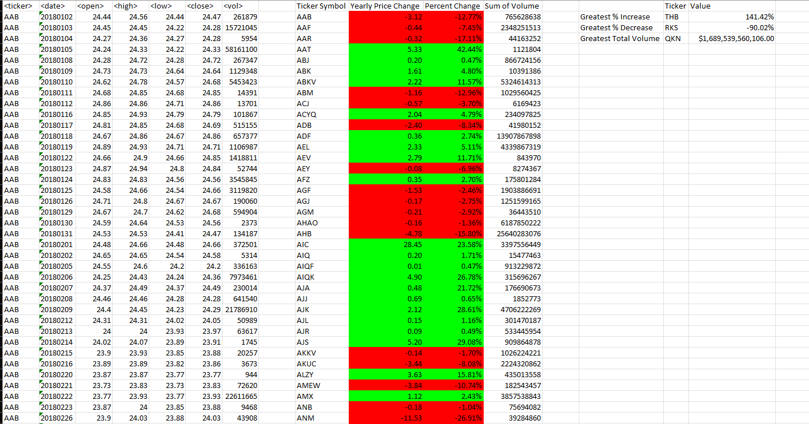
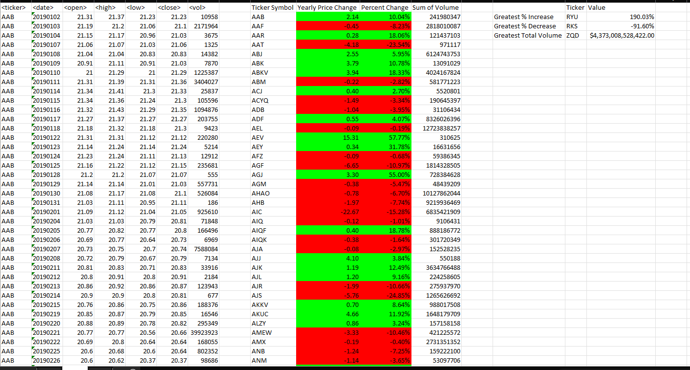
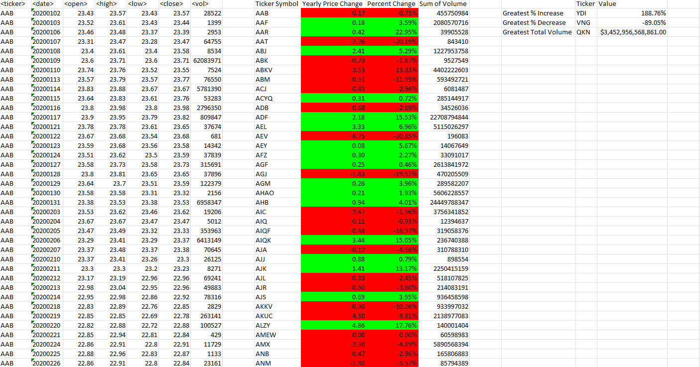

# VBA_challenge
analysis of stock data from 2018-2020 using Excel VBA
First, I looked at the volume sums for each ticket symbol, we also found the yearly change and percent change with a loop. We also coded in conditional formatting to show where the changes went up and where they went down. I also coded in a small summary table in the top left corner with the greatesst increase, gretaest decrease, and greatest volume fro the year.

